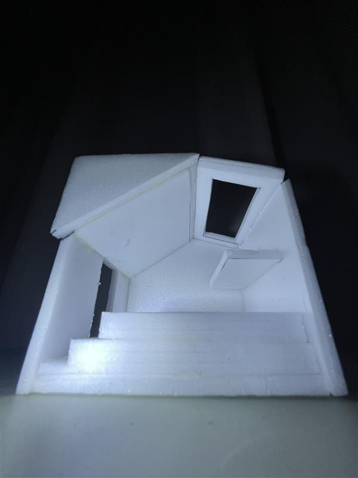
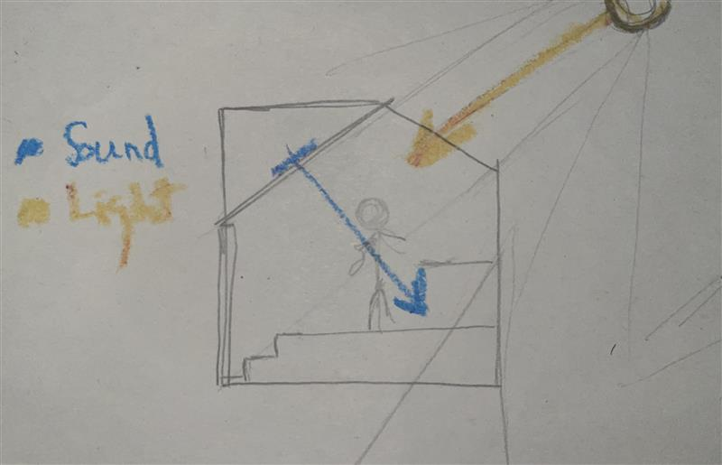
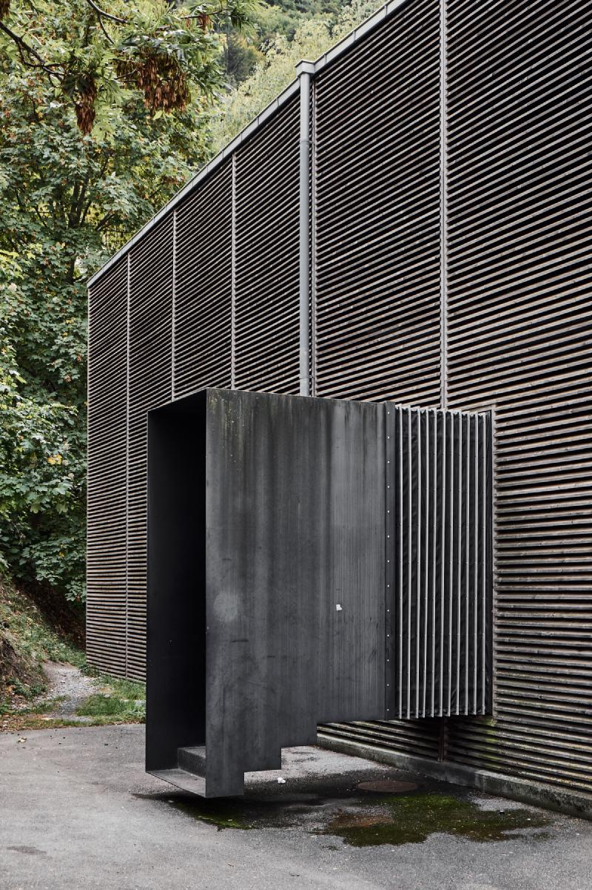
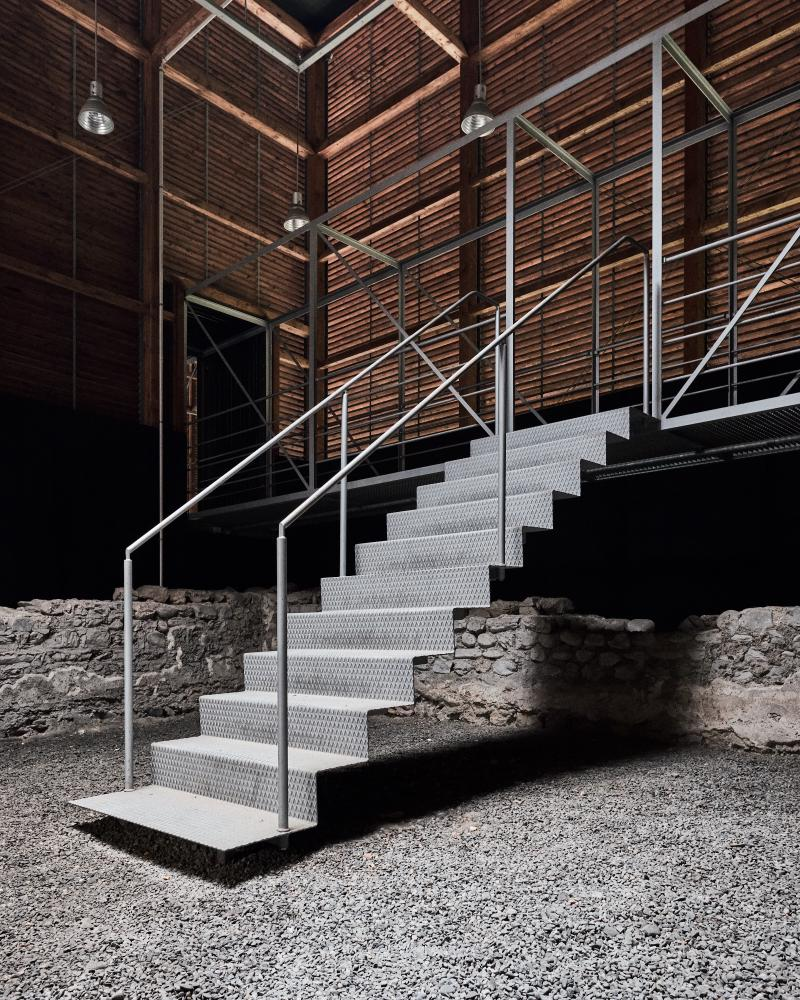
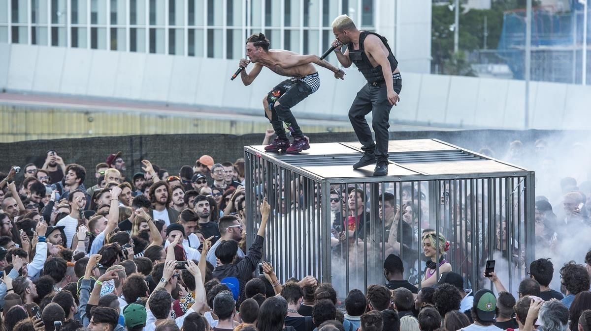

# Trance Choir
**Concepts behind the *Trance Choir* project by Ultra Voye**
DJ booth installation — work in progress.

---

## A. Introduction

*Trance Choir* is a project of introspection for DJs — an open question about how they relate to the Mystery. A gesture of adoration through euro-trance music <small>[Note 1]</small>.

DJs usually perform before a thirsty crowd, expecting them to pump the party [1]. Ultra Voye wonders whether DJs also need a break — a space of their own to speak inwardly, and to find God within their music.

Seek the Mystery, speak to It and play for God. Go on retreat, grind your soul and lift it up.

**God, too, is thirsty.**

   
  <em>Figure A.1. <a href="https://historia-arte.com/obras/la-cancion-de-los-angeles">“Song of the Angels”</a> [2] by Bouguereau — A group of angels playing music for the Christ Child and His Mother.</em> 

<small> [Note 1] *The project’s musical scope is not limited to euro-trance; other close genres may also serve as vehicles of spiritual exploration.*
</small>

---

## B. Concept

**From personal experience to materiality**

### Experience

**ACT I: POV. First exposure to BCM and euro-trance**

It’s December 2024. I’ve been having a rough few months. It’s night-time, and we’re heading to a club near Gran Vía. Young, joyful people gather by the entrance. I’m with [@jorgeselfother](https://github.com/jorgeselfother). 

We’re going to BCM V [3]. Just a few hours ago, I didn’t even know who Baby Pantera was [4]. We walk down the stairs. It’s the first turn of the set.

What is this music? It’s beautiful, it’s violent. The beats are frenetic, overwhelming. It’s condensed euphoria. It’s euro-trance.

Months later, after countless hours on SoundCloud playlists, I realized that this had been the sound of my own purgatory — the redemption of Ultra Voye. Music for the demons of the desert to speak. Music for the God in my heart to forgive.

   
  <em>Figure B.1. Entrance to BCM V — <a href="https://github.com/jorgeselfother">@jorgeselfother</a> texting a friend to meet her later that night on the dance floor. Hands on his phone, ticket held between his lips. No time to waste.</em>

**ACT II: Why do I keep coming to the club?** 
TO-DO

**ACT III: I look for God** 
TO-DO

**ACT IV: Wait — all these DJs…** 
TO-DO

### Materiality

**Avoiding egos and demonds:**

---
## C. Method

**TO-DO**: Might need to move-up references to open and discuss the methodology better.

**Model 0 — Prototype**

  
  
   
  <em>Figure B.2. Model 0 prototype: a cubicle. No geometric distractions. The entrance includes a stair, humbling the spirit of the DJ who must walk through the narrow passage. Light descends from an elevated place the DJ must transcend through their music. Shadows are left behind. Time for redemption.</em>

**Model 0 — Review**

   
  <em>Figure B.3. Model 0 review. Light comes from above; the sound system is placed behind the DJ. The orientation is not bidirectional — light and sound should be aligned.</em>

WIP

---
## D. References

### D.1. Architectural References

  
   
  <em>Figure D.1.1. <a href="https://divisare.com/projects/397572-peter-zumthor-august-fischer-shelter-for-roman-ruins">Shelter for Roman Ruins</a>. Design by Peter Zumthor, photos by August Fischer [5]. Floating stairs both at the entrance of the shelter (left) and in the interior (right). The use of robust materials (left) and intelligent structural design (right) convey a levitating sensation.</em>

### D.2. Aesthetic References

**Egos and demonds:** (The title by elperiodico is gold: Yung Beef endemonia el Primavera Sound) TO-DO.

   
  <em>Figure D.2.1. <a href="https://www.elperiodico.com/es/ocio-y-cultura/20180531/cronica-yung-beef-primavera-sound-6849964"> "Yung Beef unleashes the demons at Primavera Sound”</a> [6] Yung Beef and Hakim performing on top of a metallic cage (with Brat Star DJing inside it).  
  Primavera Sound, Barcelona (2018).</em>

### D.3. Musical References
---

## E. Reflection
---
## Bibliography

- [1] [*BCM #02* by Baby Pantera — Sound Cloud](https://on.soundcloud.com/O7T9KOe88rW7jnqm1O)

- [2] [*Song of the Angels* — historia-arte.com](https://historia-arte.com/obras/la-cancion-de-los-angeles)

- [2] [*Baby Club Music (BCM) Party* — instagram.com](https://www.instagram.com/bcmparty/)

- [4] [*Baby Pantera* — Sound Cloud](https://soundcloud.com/baby_pantera)

- [5] [*Shelter for Roman Ruin* — divisare.com](https://divisare.com/projects/397572-peter-zumthor-august-fischer-shelter-for-roman-ruins)

- [6] [*Yung Beef unleashes the demons at Primavera Sound* — elperiodico.com](https://www.elperiodico.com/es/ocio-y-cultura/20180531/cronica-yung-beef-primavera-sound-6849964)

---

## Acknowledgements
Special thanks to [@jorgeselfother](https://github.com/jorgeselfother) for exposing UV to the 2024/25 DJ scene.